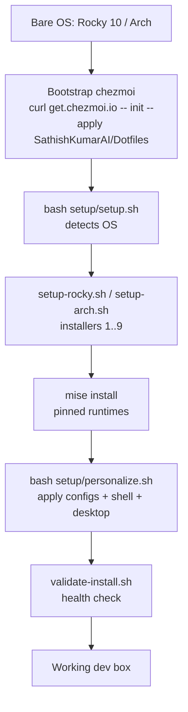

# Provisioning Architecture

**Intro.** This repo provisions **one machine** from bare OS to working dev box.
The model is three independent layers — **packages**, **runtimes**, **configs** —
plus a final **personalize** step that glues them to *you*. Each layer is owned by
a different tool so they version, re-run, and fail independently.

> Complements the [Installation Reference](./installation-reference.mdx) (the
> per-script inventory). This page is the *model*; that page is the *catalog*.

## The three layers (+ glue)

| Layer | Owner | Source | What it provides |
|-------|-------|--------|------------------|
| **Packages / apps** | `setup/*.sh` | this repo | System packages, Flatpaks, CLI tools, desktop theme — distro-aware (dnf / pacman) |
| **Runtimes** | **mise** | `~/.config/mise/config.toml` | Pinned Python 3.12, Node 24 LTS, Go 1.26, Rust 1.95 |
| **Configs** | **chezmoi** | `chezmoi/` → `$HOME` | Dotfiles: shell, git, wezterm, nvim, starship, zellij |
| **Glue** | `setup/personalize.sh` | this repo | `chezmoi apply` + default shell + history import + desktop tweaks + validate |

Why split this way: a tool upgrade (`mise`) never touches configs; a config tweak
(`chezmoi`) never reinstalls packages; re-running installers is safe because each
step is guarded. One concern per layer = predictable, re-runnable provisioning.

## Repos involved

| Repo / path | Role |
|-------------|------|
| **`~/coding/Dotfiles`** (this) | Configs (`chezmoi/`), installers (`setup/`), docs (`docs/`) |
| `~/.config/mise/config.toml` | Runtime version pins (managed by mise, referenced here) |
| `~/coding/docs/templates` | Reusable doc + prompt skeletons (cross-repo, not machine-specific) |
| Claude Code skill marketplaces | Installed via `~/coding/scripts/install-claude-skills.sh` (separate from OS setup) |

## End-to-end flow (fresh machine)



### Run order, copy-paste

```bash
# 1. Bootstrap: install chezmoi + pull this repo + drop configs into $HOME
sh -c "$(curl -fsLS get.chezmoi.io)" -- init --apply SathishKumarAI/Dotfiles

# 2. Install packages / apps / desktop (auto-detects OS; may prompt for sudo)
bash setup/setup.sh                 # --dry-run to preview, --os rocky|arch to force

# 3. Install pinned language runtimes
mise install

# 4. Personalize: deploy latest configs, default shell, history, desktop tweaks
bash setup/personalize.sh           # --dry-run to preview, --no-chsh to skip shell change
```

`personalize.sh` is **idempotent** — re-run it any time after a `chezmoi`/config
change to re-sync the machine. Its only interactive step is `chsh` (your password).

## File map

```
Dotfiles/
├─ chezmoi/                 # CONFIG layer (source -> $HOME via chezmoi)
│  ├─ dot_zshrc dot_bashrc  #   shells (mise, starship, zoxide, fzf, direnv, atuin)
│  ├─ dot_gitconfig         #   git (delta pager, aliases, gh credential helper)
│  ├─ dot_wezterm.lua       #   terminal (Catppuccin, leader keys, status bar)
│  └─ dot_config/…          #   nvim, starship, zellij
├─ setup/                   # PACKAGE layer + glue
│  ├─ setup.sh              #   entry: detect OS -> per-OS orchestrator
│  ├─ setup-rocky.sh        #   Rocky/Fedora chain of installers 1..9
│  ├─ setup-arch.sh         #   Arch/Manjaro chain
│  ├─ install-*.sh          #   per-domain installers (cli, automation, workflow…)
│  ├─ gnome-*.sh            #   desktop: theme, panel, keybindings
│  ├─ personalize.sh        #   GLUE: chezmoi apply + chsh + atuin + gsettings + validate
│  └─ validate-install.sh   #   health check (--fix, logging)
└─ docs/                    # this documentation
```

## Idempotency & failure model

- **Installers** continue on error (one failed step won't abort the run) and skip
  already-installed tools.
- **chezmoi** only writes files that differ; `chezmoi diff` previews, `--force`
  overrides local divergence.
- **mise** is declarative — `mise install` reconciles to the pinned versions.
- **personalize.sh** guards every step with `command -v` and supports `--dry-run`.

## Links

- [Installation Reference](./installation-reference.mdx) — per-script inventory + sizes
- [Pros & Cons](./pros-and-cons.mdx) — tool tradeoffs
- [chezmoi](../automation/chezmoi.mdx) · [mise](../automation/mise.mdx)
- Source: `setup/setup.sh`, `setup/personalize.sh`
